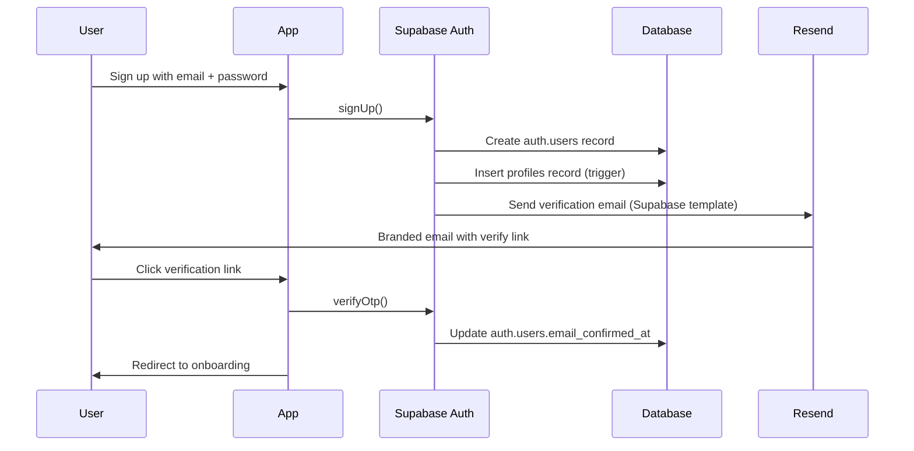
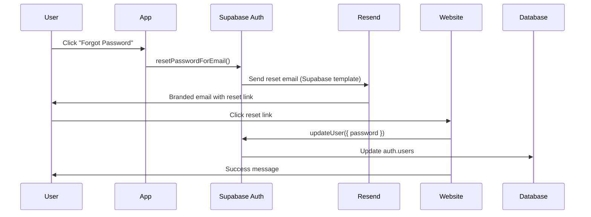
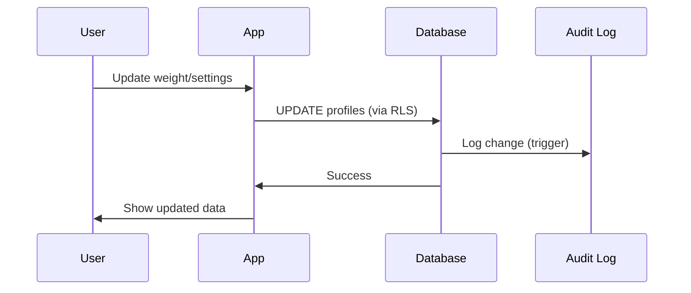
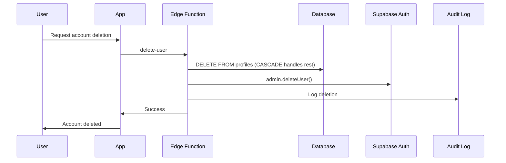

# 🏗️ MOMMY MILK BAR - DATABASE ARCHITECTURE
## State-of-the-Art Data Model & Implementation Guide

**Version:** 2.0
**Date:** 2025-12-03
**Status:** Ready for Implementation

---

## 📋 TABLE OF CONTENTS

1. [Design Philosophy](#design-philosophy)
2. [Data Collection Policy](#data-collection-policy)
3. [Database Schema](#database-schema)
4. [Account Management Flow](#account-management-flow)
5. [Email Architecture](#email-architecture)
6. [GDPR Compliance](#gdpr-compliance)
7. [Security Model](#security-model)
8. [Implementation Checklist](#implementation-checklist)

---

## 🎯 DESIGN PHILOSOPHY

### Core Principles
1. **Privacy-First**: Collect only what's necessary for functionality
2. **GDPR-Native**: Built-in compliance, not bolted-on
3. **User-Centric**: Make account management effortless
4. **Maintainer-Friendly**: Simple, not clever
5. **Supabase-Native**: Use platform features, don't reinvent

### Key Decisions
- ✅ Use Supabase's built-in authentication (no custom tokens)
- ✅ Auth emails via Supabase templates
- ✅ Marketing emails via Edge Functions
- ✅ Cascade deletions for data integrity
- ✅ Minimal PII collection
- ✅ Audit logging for security
- ✅ Auto-anonymization for analytics

---

## 📊 DATA COLLECTION POLICY

### What We COLLECT (and Why)

| Data Point | Table | Purpose | Required |
|------------|-------|---------|----------|
| Email | `auth.users` | Authentication, password reset | ✅ Yes |
| Weight (kg) | `profiles` | Alcohol metabolism calculation | ❌ No* |
| Baby birthdate | `babies` | Age-appropriate content | ✅ Yes** |
| Drink data | `drinks` | Core functionality | ✅ Yes |
| Feeding logs | `feeding_logs` | Pattern analysis | ❌ No |
| Consent flags | `profiles` | Legal compliance | ✅ Yes |

\* Required for accurate calculations, but user can skip
\** Per baby, not mother's birthdate

### What We DON'T COLLECT
- ❌ Real names (use display labels like "Baby 1")
- ❌ Addresses
- ❌ Phone numbers
- ❌ Precise birthdates (mother)
- ❌ Photos
- ❌ Payment info (future: Apple/Google handles)
- ❌ Raw IP addresses (hash only for security)

---

## 🗄️ DATABASE SCHEMA

### 1. PROFILES
**Purpose**: Mother's profile and app settings

```sql
CREATE TABLE profiles (
  -- Identity (links to Supabase Auth)
  id UUID REFERENCES auth.users(id) ON DELETE CASCADE PRIMARY KEY,

  -- Physical data (for calculations)
  weight_kg DECIMAL(5,2), -- Optional but recommended

  -- App preferences
  safety_mode TEXT DEFAULT 'cautious' CHECK (safety_mode IN ('normal', 'cautious')),
  notifications_enabled BOOLEAN DEFAULT true,

  -- Onboarding
  has_completed_onboarding BOOLEAN DEFAULT false,
  onboarding_completed_at TIMESTAMP WITH TIME ZONE,

  -- GDPR Consent
  consent_version TEXT DEFAULT '1.0.0' NOT NULL,
  age_consent BOOLEAN DEFAULT false NOT NULL,
  medical_disclaimer_consent BOOLEAN DEFAULT false NOT NULL,
  privacy_policy_consent BOOLEAN DEFAULT false NOT NULL,
  marketing_consent BOOLEAN DEFAULT false,
  analytics_consent BOOLEAN DEFAULT false,
  consent_given_at TIMESTAMP WITH TIME ZONE, -- NEW: When consent was given

  -- GDPR Compliance (NEW)
  processing_basis TEXT DEFAULT 'consent' CHECK (processing_basis IN ('consent', 'contract', 'legal_obligation')),
  data_retention_years INTEGER DEFAULT 2 CHECK (data_retention_years >= 1 AND data_retention_years <= 7),

  -- Optional features
  timezone TEXT, -- NEW: For accurate predictions (e.g., 'Europe/Amsterdam')

  -- Timestamps
  created_at TIMESTAMP WITH TIME ZONE DEFAULT NOW() NOT NULL,
  updated_at TIMESTAMP WITH TIME ZONE DEFAULT NOW() NOT NULL,
  last_active_at TIMESTAMP WITH TIME ZONE DEFAULT NOW() NOT NULL
);
```

**Removed Fields** (now handled by Supabase Auth):
- ❌ `email` - Use `auth.users.email`
- ❌ `email_verified` - Use `auth.users.email_confirmed_at`
- ❌ `email_verification_token` - Handled by Supabase
- ❌ `email_verification_sent_at` - Handled by Supabase
- ❌ `email_verified_at` - Handled by Supabase

**Removed Fields** (deprecated for privacy):
- ❌ `mother_name` - Not needed
- ❌ `mother_birthdate` - Not needed
- ❌ `height_cm` - Not used in calculations

---

### 2. BABIES
**Purpose**: Baby data for feeding calculations

```sql
CREATE TABLE babies (
  id UUID DEFAULT gen_random_uuid() PRIMARY KEY,
  user_id UUID REFERENCES profiles(id) ON DELETE CASCADE NOT NULL,

  -- Display info (privacy-first)
  display_label TEXT NOT NULL DEFAULT 'Baby', -- e.g., "Baby 1", "Kleintje", "Kindje"
  birthdate DATE NOT NULL, -- For age calculations

  -- Feeding preferences
  feeding_type TEXT CHECK (feeding_type IN ('breast', 'formula', 'mix')),
  feeds_per_day INTEGER CHECK (feeds_per_day >= 0 AND feeds_per_day <= 20),
  typical_amount_ml INTEGER CHECK (typical_amount_ml > 0),
  pump_preference TEXT CHECK (pump_preference IN ('yes', 'no', 'later')),

  -- Status
  is_active BOOLEAN DEFAULT true NOT NULL,

  -- Timestamps
  created_at TIMESTAMP WITH TIME ZONE DEFAULT NOW() NOT NULL,
  updated_at TIMESTAMP WITH TIME ZONE DEFAULT NOW() NOT NULL
);
```

**Removed Fields**:
- ❌ `name` - Use `display_label` for privacy
- ❌ `weight_kg` - Baby weight not needed for calculations
- ❌ `length_cm` - Not used

---

### 3. DRINK SESSIONS
**Purpose**: Track drinking sessions

```sql
CREATE TABLE drink_sessions (
  id UUID DEFAULT gen_random_uuid() PRIMARY KEY,
  user_id UUID REFERENCES profiles(id) ON DELETE CASCADE NOT NULL,
  baby_id UUID REFERENCES babies(id) ON DELETE SET NULL,

  -- Session details
  started_at TIMESTAMP WITH TIME ZONE NOT NULL,
  completed_at TIMESTAMP WITH TIME ZONE,
  mode TEXT DEFAULT 'now' CHECK (mode IN ('now', 'backfill', 'plan_ahead')),

  -- Calculations
  total_standard_drinks DECIMAL(5,2) DEFAULT 0 NOT NULL,
  predicted_safe_at TIMESTAMP WITH TIME ZONE,
  weight_kg_at_session DECIMAL(5,2), -- Snapshot for historical accuracy

  -- Timestamps
  created_at TIMESTAMP WITH TIME ZONE DEFAULT NOW() NOT NULL,
  updated_at TIMESTAMP WITH TIME ZONE DEFAULT NOW() NOT NULL
);
```

---

### 4. DRINKS
**Purpose**: Individual drinks within sessions

```sql
CREATE TABLE drinks (
  id UUID DEFAULT gen_random_uuid() PRIMARY KEY,
  session_id UUID REFERENCES drink_sessions(id) ON DELETE CASCADE NOT NULL,

  -- Drink details
  type TEXT NOT NULL, -- 'wine', 'beer', 'cocktail'
  name TEXT NOT NULL,
  quantity DECIMAL(6,2) NOT NULL, -- ml
  alcohol_content DECIMAL(4,2) NOT NULL, -- percentage
  standard_drinks DECIMAL(5,2) NOT NULL,

  -- Timing
  consumed_at TIMESTAMP WITH TIME ZONE DEFAULT NOW() NOT NULL,
  created_at TIMESTAMP WITH TIME ZONE DEFAULT NOW() NOT NULL
);
```

---

### 5. FEEDING LOGS
**Purpose**: Track feeding patterns

```sql
CREATE TABLE feeding_logs (
  id UUID DEFAULT gen_random_uuid() PRIMARY KEY,
  baby_id UUID REFERENCES babies(id) ON DELETE CASCADE NOT NULL,

  -- Feeding details
  type TEXT CHECK (type IN ('breast', 'bottle', 'pump')),
  fed_at TIMESTAMP WITH TIME ZONE NOT NULL,
  duration_minutes INTEGER CHECK (duration_minutes >= 0),
  amount_ml INTEGER CHECK (amount_ml >= 0),
  notes TEXT,

  -- Timestamp
  created_at TIMESTAMP WITH TIME ZONE DEFAULT NOW() NOT NULL
);
```

---

### 6. CONTENT TIPS (CMS)
**Purpose**: Educational content delivery

```sql
CREATE TABLE content_tips (
  id UUID DEFAULT gen_random_uuid() PRIMARY KEY,

  -- Content
  category TEXT NOT NULL CHECK (category IN ('safety', 'planning', 'health', 'general', 'milestone')),
  title TEXT NOT NULL,
  content TEXT NOT NULL,

  -- Targeting
  target_baby_age_min_days INTEGER,
  target_baby_age_max_days INTEGER,
  target_feeding_types TEXT[],

  -- Display
  priority INTEGER DEFAULT 0,
  is_active BOOLEAN DEFAULT true,

  -- Timestamps
  created_at TIMESTAMP WITH TIME ZONE DEFAULT NOW() NOT NULL,
  updated_at TIMESTAMP WITH TIME ZONE DEFAULT NOW() NOT NULL
);
```

---

### 7. USER TIP INTERACTIONS
**Purpose**: Personalization and engagement tracking

```sql
CREATE TABLE user_tip_interactions (
  id UUID DEFAULT gen_random_uuid() PRIMARY KEY,
  user_id UUID REFERENCES profiles(id) ON DELETE CASCADE NOT NULL,
  tip_id UUID REFERENCES content_tips(id) ON DELETE CASCADE NOT NULL,

  -- Interaction
  viewed_at TIMESTAMP WITH TIME ZONE DEFAULT NOW() NOT NULL,
  helpful BOOLEAN,
  dismissed BOOLEAN DEFAULT false,

  UNIQUE(user_id, tip_id)
);
```

---

### 8. ANALYTICS EVENTS (Privacy-First)
**Purpose**: Usage analytics with auto-anonymization

```sql
CREATE TABLE analytics_events (
  id UUID DEFAULT gen_random_uuid() PRIMARY KEY,
  user_id UUID REFERENCES profiles(id) ON DELETE SET NULL,

  -- Event data
  event_type TEXT NOT NULL,
  event_data JSONB DEFAULT '{}'::jsonb,

  -- Timing
  occurred_at TIMESTAMP WITH TIME ZONE DEFAULT NOW() NOT NULL,

  -- Privacy
  anonymized BOOLEAN DEFAULT false
);

-- Auto-anonymize after 90 days
CREATE OR REPLACE FUNCTION anonymize_old_analytics()
RETURNS void AS $$
BEGIN
  UPDATE analytics_events
  SET user_id = NULL, anonymized = true
  WHERE occurred_at < NOW() - INTERVAL '90 days'
  AND anonymized = false;
END;
$$ LANGUAGE plpgsql;
```

---

### 9. DATA REQUESTS (GDPR)
**Purpose**: Handle export and deletion requests

```sql
CREATE TABLE data_requests (
  id UUID DEFAULT gen_random_uuid() PRIMARY KEY,
  user_id UUID REFERENCES profiles(id) ON DELETE CASCADE NOT NULL,

  -- Request details
  request_type TEXT NOT NULL CHECK (request_type IN ('export', 'delete')),
  status TEXT DEFAULT 'pending' CHECK (status IN ('pending', 'processing', 'completed', 'failed')),

  -- Result
  export_url TEXT,
  error_message TEXT,

  -- Timing
  requested_at TIMESTAMP WITH TIME ZONE DEFAULT NOW() NOT NULL,
  completed_at TIMESTAMP WITH TIME ZONE
);
```

---

### 10. AUDIT LOG (Security)
**Purpose**: Security monitoring and compliance

```sql
CREATE TABLE audit_log (
  id UUID DEFAULT gen_random_uuid() PRIMARY KEY,
  user_id UUID REFERENCES profiles(id) ON DELETE SET NULL,

  -- Action
  action TEXT NOT NULL CHECK (action IN (
    'account_created',
    'account_deleted',
    'data_exported',
    'profile_updated',
    'baby_created',
    'baby_updated',
    'baby_deleted',
    'password_changed',
    'email_verified',
    'consent_updated'
  )),

  -- Resource
  resource_type TEXT CHECK (resource_type IN ('profile', 'baby', 'drink_session', 'auth', 'data')),
  resource_id TEXT,

  -- Security (hashed IP, not raw)
  ip_address_hash TEXT,

  -- Metadata
  metadata JSONB DEFAULT '{}'::jsonb,

  -- Timestamp
  occurred_at TIMESTAMP WITH TIME ZONE DEFAULT NOW() NOT NULL
);
```

---

## 🔐 ACCOUNT MANAGEMENT FLOW

### 1. Account Creation


**Implementation:**
```typescript
// In app - Simple!
const { data, error } = await supabase.auth.signUp({
  email: 'user@example.com',
  password: 'securePassword123',
  options: {
    emailRedirectTo: 'mommymilkbar://verify-email'
  }
});
```

**No custom Edge Functions needed!** Supabase handles everything.

---

### 2. Password Reset


**Implementation:**
```typescript
// Request reset - Simple!
const { error } = await supabase.auth.resetPasswordForEmail(email, {
  redirectTo: 'https://mommymilkbar.nl/reset-password'
});
```

---

### 3. Profile Updates


---

### 4. Account Deletion


**CASCADE automatically deletes:**
- ✅ All babies
- ✅ All feeding logs (via babies cascade)
- ✅ All drink sessions
- ✅ All drinks (via sessions cascade)
- ✅ All tip interactions
- ✅ All data requests
- Analytics: user_id set to NULL (preserved for aggregate stats)

---

## 📧 EMAIL ARCHITECTURE

### Email Types

| Type | Method | From Address | Tool |
|------|--------|--------------|------|
| **Sign Up Verification** | Supabase Template | `info@mommymilkbar.nl` | Supabase Auth |
| **Password Reset** | Supabase Template | `info@mommymilkbar.nl` | Supabase Auth |
| **Email Change** | Supabase Template | `info@mommymilkbar.nl` | Supabase Auth |
| **Welcome Onboarding** | Edge Function | `info@mommymilkbar.nl` | Resend API |
| **Weekly Tips** | Edge Function | `info@mommymilkbar.nl` | Resend API |

### Email Template Organization

```
/email-templates/
├── auth/                          (Upload to Supabase Dashboard)
│   ├── confirm-signup.html        ✅ Supabase native
│   ├── reset-password.html        ✅ Supabase native
│   └── change-email.html          ✅ Supabase native
│
└── marketing/                     (Used by Edge Functions)
    ├── welcome-onboarding.html    📨 Edge Function
    └── weekly-tips.html           📨 Edge Function
```

### Supabase Email Configuration

**Dashboard Settings:**
- SMTP Host: `smtp.resend.com`
- SMTP Port: `587`
- SMTP User: `resend`
- SMTP Password: `[RESEND_API_KEY]`
- Sender Email: `info@mommymilkbar.nl`
- Sender Name: `Mommy Milk Bar`

---

## 🛡️ GDPR COMPLIANCE

### Data Subject Rights

| Right | Implementation | Function |
|-------|----------------|----------|
| **Right to Access** | Export all data | `export_user_data()` |
| **Right to Erasure** | Delete account + data | `delete_user_data()` |
| **Right to Rectification** | Update profile in app | Standard CRUD |
| **Right to Data Portability** | JSON export | `export_user_data()` |
| **Right to Object** | Opt-out flags | Consent fields |
| **Right to be Informed** | Privacy policy | App + Website |

### Consent Tracking

```sql
-- Every user must accept these before using app
age_consent                    -- 18+ confirmation
medical_disclaimer_consent     -- Not medical advice
privacy_policy_consent         -- Data usage

-- Optional consents
marketing_consent              -- Newsletters/tips
analytics_consent              -- Usage tracking
```

### Data Retention

```sql
-- Configurable per user (default: 2 years)
data_retention_years INTEGER DEFAULT 2

-- Auto-cleanup function (run monthly)
CREATE OR REPLACE FUNCTION cleanup_old_user_data()
RETURNS void AS $$
BEGIN
  DELETE FROM analytics_events
  WHERE occurred_at < NOW() - INTERVAL '90 days';

  DELETE FROM audit_log
  WHERE occurred_at < NOW() - INTERVAL '2 years';
END;
$$ LANGUAGE plpgsql;
```

---

## 🔒 SECURITY MODEL

### Row Level Security (RLS)

**Critical Rules:**
1. ✅ RLS ENABLED on all `public` schema tables
2. ❌ RLS DISABLED on `auth` schema (Supabase managed)
3. ✅ Users can ONLY access their own data
4. ✅ Content tips are read-only for authenticated users

### RLS Policy Pattern

```sql
-- Standard pattern for all user data tables
CREATE POLICY "Users can view own data"
  ON table_name FOR SELECT
  USING (auth.uid() = user_id);

CREATE POLICY "Users can insert own data"
  ON table_name FOR INSERT
  WITH CHECK (auth.uid() = user_id);

CREATE POLICY "Users can update own data"
  ON table_name FOR UPDATE
  USING (auth.uid() = user_id)
  WITH CHECK (auth.uid() = user_id);

CREATE POLICY "Users can delete own data"
  ON table_name FOR DELETE
  USING (auth.uid() = user_id);
```

### Cascade Deletions

**Deletion Flow:**
```
DELETE profile
  ├─ CASCADE → babies
  │   └─ CASCADE → feeding_logs
  ├─ CASCADE → drink_sessions
  │   └─ CASCADE → drinks
  ├─ CASCADE → user_tip_interactions
  ├─ CASCADE → data_requests
  └─ SET NULL → analytics_events (preserved)
      SET NULL → audit_log (preserved)
```

---

## ✅ IMPLEMENTATION CHECKLIST

### Phase 1: Database Setup
- [ ] Run master migration file
- [ ] Verify all tables created
- [ ] Verify all indexes created
- [ ] Verify all triggers created
- [ ] Verify CASCADE deletions work
- [ ] Verify RLS policies applied
- [ ] Test data export function
- [ ] Test data deletion function

### Phase 2: Email Setup
- [ ] Configure Supabase SMTP (Resend)
- [ ] Upload auth email templates
- [ ] Test sign-up verification email
- [ ] Test password reset email
- [ ] Update Edge Functions to use `info@mommymilkbar.nl`
- [ ] Remove custom auth Edge Functions

### Phase 3: Testing
- [ ] Create test account
- [ ] Verify email sent
- [ ] Verify email with link
- [ ] Complete onboarding
- [ ] Add baby data
- [ ] Log drinks
- [ ] Log feedings
- [ ] Export data (verify JSON)
- [ ] Delete account (verify CASCADE)
- [ ] Verify orphaned data cleaned up

### Phase 4: Migration
- [ ] Backup production database
- [ ] Run migrations on production
- [ ] Migrate existing users (if any)
- [ ] Verify production auth emails work
- [ ] Monitor for 48 hours

---

## 📚 DEVELOPER GUIDE

### Quick Reference

**Get user's email:**
```typescript
const { data: { user } } = await supabase.auth.getUser();
const email = user?.email;
```

**Get user's profile:**
```typescript
const { data: profile } = await supabase
  .from('profiles')
  .select('*')
  .eq('id', user.id)
  .single();
```

**Get user's babies:**
```typescript
const { data: babies } = await supabase
  .from('babies')
  .select('*')
  .eq('user_id', user.id)
  .order('created_at', { ascending: true });
```

**Export user data (GDPR):**
```typescript
const { data } = await supabase.rpc('export_user_data');
```

**Delete account:**
```typescript
// Call Edge Function (handles CASCADE + auth.users deletion)
const { data, error } = await supabase.functions.invoke('delete-user');
```

---

## 🎉 SUCCESS METRICS

After implementation, verify:

✅ **User Experience**
- Sign-up to onboarding < 2 minutes
- Password reset works in < 1 minute
- Account deletion completes in < 5 seconds

✅ **Data Privacy**
- No PII in analytics_events (after anonymization)
- All user data deleted on account deletion
- Email verification works 100%

✅ **GDPR Compliance**
- Data export includes all user data
- Consent tracked with timestamps
- Audit log captures all sensitive actions

✅ **Security**
- RLS prevents unauthorized access
- Cascade deletions prevent orphaned data
- Audit log detects suspicious activity

---

**End of Architecture Document**
For questions or updates, contact: [Your Email]
